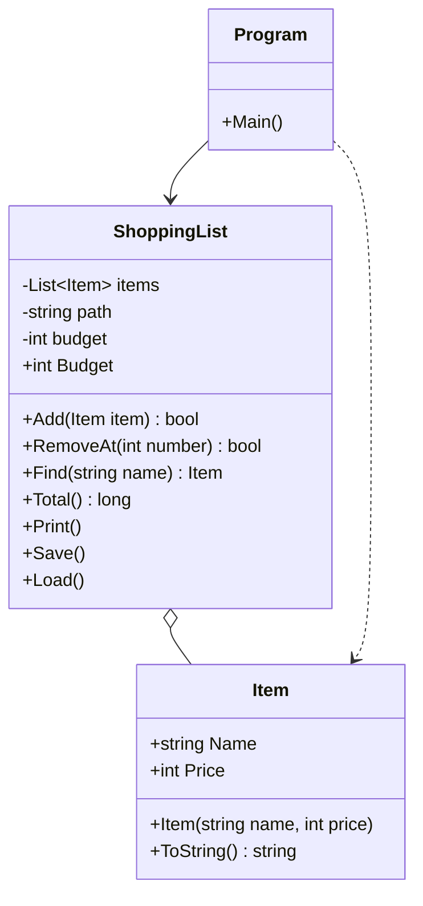

# Robust inköpslista

Det här är min inlämning för Kunskapskontroll 2 i C#. Jag fick en inköpslista som sparar varorna i `items.txt`. Den gick att bygga, men den fungerade inte, och jag skulle hitta sex fel och sedan bygga ut programmet.

Jag är fortfarande ny på C#, så jag har skrivit det jag faktiskt förstått och försökt förklara varje ändring med egna ord. Jag anger metodnamn i stället för radnummer, eftersom raderna flyttar sig när man ändrar koden.

## Del 1: De sex felen

### 1. Programmet kraschade direkt vid start
Metod: `ShoppingList.Load()`

Första gången jag körde programmet kom `IndexOutOfRangeException`. Jag läste hela felmeddelandet och såg att det pekade på `Load()`.

Orsaken var att `Save()` skriver `\r\n` efter varje rad, också efter den sista. `Load()` delade texten vid `'\n'`, så det blev en tom "rad" sist. En tom sträng delad vid `;` ger bara ett element, och koden försökte ändå läsa `parts[1]`, som inte fanns.

Jag fick också reda på att `\r` blev kvar på slutet av varje namn. Därför kunde `Find("Mjölk")` inte hitta `"Mjölk\r"`, trots att varan syntes i listan. Det var alltså samma fel som gav både kraschen och den misslyckade sökningen.

Lösning: jag läser filen med `File.ReadAllLines`, hoppar över tomma rader och delar med `Split(';', 2)`. Sedan kontrollerar jag `parts.Length` innan jag använder arrayen.

### 2. Programmet kraschade när items.txt saknades
Metod: `ShoppingList.Load()`

När jag döpte om filen kastade `File.ReadAllText` ett `FileNotFoundException`. Ingenting fångade det.

Lösning: `Load()` avslutas direkt om `File.Exists(path)` är falsk, och programmet startar med en tom lista. Själva läsningen ligger i en `try` som fångar `IOException` och `UnauthorizedAccessException`.

### 3. Programmet kraschade på inmatning som inte var ett tal
Metoder: `ShoppingList.Load()` och `Program.cs`

`int.Parse` kastar `FormatException` om texten inte är ett tal, till exempel om jag skriver bokstäver som pris.

Lösning: jag bytte alla `int.Parse` mot `int.TryParse`. Den kastar inget undantag, utan svarar `true` eller `false`. I `Program.cs` skriver programmet "Ogiltigt pris" och lägger inte till något. I `Load()` hoppas raden över och användaren får veta det.

### 4. Programmet kraschade när jag tog bort en vara som inte finns
Metod: `ShoppingList.RemoveAt()`

Nummer 0, ett negativt tal eller ett tal som är större än listan gav `ArgumentOutOfRangeException`, eftersom `items.RemoveAt(number - 1)` använde ett index utanför listan.

Lösning: metoden kollar först `number >= 1 && number <= items.Count` och returnerar `false` om det inte stämmer. Annars tar den bort varan och returnerar `true`. `Program.cs` skriver "Ogiltigt nummer." när svaret är `false`.

### 5. Totalsumman var för låg (inget fel visades)
Metod: `ShoppingList.Total()`

Det här var det felet som inte kraschade. Loopen började på `i = 1`, men listor börjar på index 0, så första varan räknades aldrig med. Jag hittade det genom att räkna ihop summan för hand.

Lösning: jag ändrade till `i = 0`. Jag ändrade också `sum` och returtypen från `int` till `long`, så att väldigt stora priser inte kan gå runt och bli ett negativt tal. Det var inte själva felet, bara en extra säkerhet.

### 6. Save() sa att det gick bra när det inte gjorde det
Metod: `ShoppingList.Save()`

Här fanns en tom `catch { }`. Om filen inte gick att skriva sväljdes felet, och programmet skrev "Listan är sparad." ändå.

Lösning: jag flyttade meddelandet in i `try`-blocket, så det bara skrivs om sparandet lyckades. Jag fångar `IOException` och `UnauthorizedAccessException` var för sig och skriver ut vad som gick fel med `error.Message`.

## Del 2: Det jag byggde ut

### Item skyddar sig själv
Konstruktorn kastar `ArgumentException` om namnet är tomt eller bara blanksteg, och `ArgumentOutOfRangeException` om priset är negativt. Pris 0 tillåter jag. Egenskaperna `Name` och `Price` har bara `get`, så en vara kan inte ändras till något ogiltigt efteråt.

I `Program.cs` fångar jag `ArgumentOutOfRangeException` först. Jag fick lära mig att ordningen spelar roll, eftersom den ärver från `ArgumentException`. Om `ArgumentException` stod först skulle den andra aldrig köras. I `Load()` hoppar jag över rader som ger `ArgumentException`.

### Budgettak
`ShoppingList` får en budget i konstruktorn, till exempel `new ShoppingList("items.txt", 4200)`. I `Add` räknar jag ut `Total() + item.Price`. Om summan blir större än budgeten läggs varan inte till. `Print()` visar totalsumman och budgeten tillsammans, till exempel `Totalt: 136 / 4200 kr`.

## Designval: hur Add säger nej

Jag lät `Add` returnera `bool` i stället för att kasta ett undantag.

Att en vara inte ryms inom budgeten är något som kan hända när som helst när man använder programmet. Det är inget programmeringsfel. Då tyckte jag att `false` passade bättre än ett undantag. `Add` skriver själv ut att budgeten överskrids, och `Program.cs` behöver bara veta om det gick eller inte, så programmet kan fortsätta köra. Det blev en vanlig `if`/`else`, och jag slapp en extra `try`/`catch`.

För `Item` valde jag tvärtom. En konstruktor kan inte returnera `false`, och ett objekt med tomt namn eller negativt pris ska aldrig skapas. Där är ett undantag rätt. `RemoveAt` returnerar `bool` av samma skäl som `Add`.

## Klassdiagram

## Det jag lärde mig
Läs hela felmeddelandet och anropsstacken, inte bara första raden. Och några av felen hängde ihop, så det lönade sig att leta efter orsaken i stället för att bara tysta symptomet.